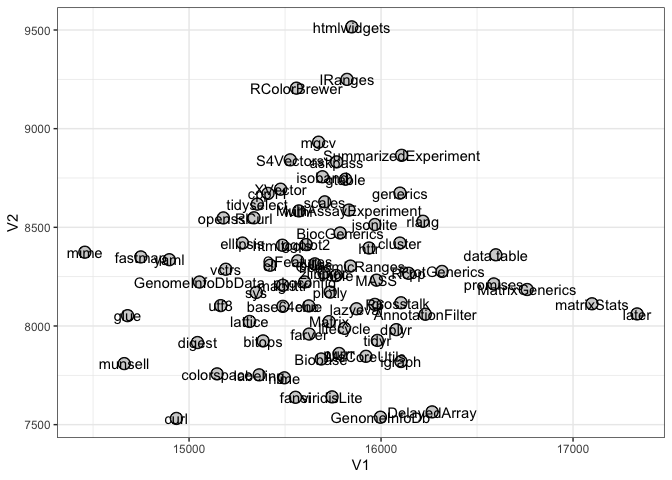
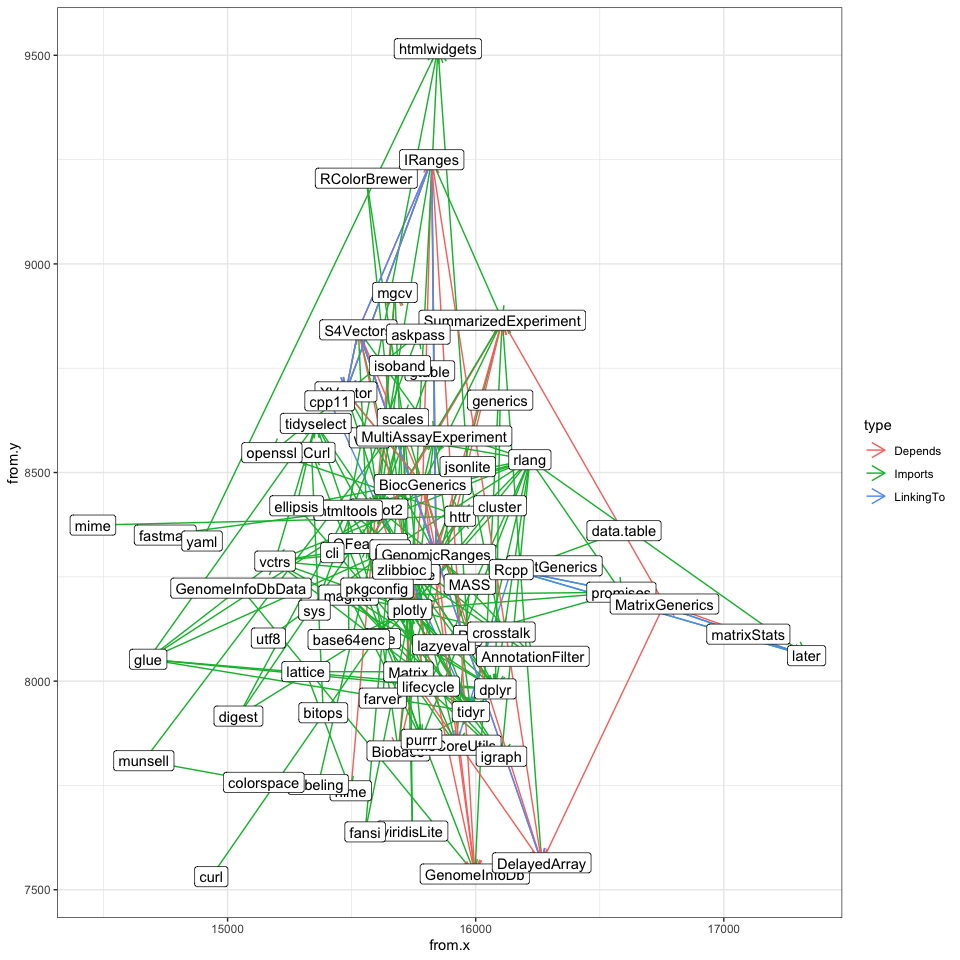

proteotools
================

## Dependency tree

``` r
library(miniCRAN)
library(dplyr)
```

    ## 
    ## Attaching package: 'dplyr'

    ## The following objects are masked from 'package:stats':
    ## 
    ##     filter, lag

    ## The following objects are masked from 'package:base':
    ## 
    ##     intersect, setdiff, setequal, union

``` r
library(ggplot2)
bioc_url <- BiocManager::repositories()[1]
bioc_url
```

    ##                                      BioCsoft 
    ## "https://bioconductor.org/packages/3.15/bioc"

``` r
pkgs <- pkgDep(
  c("ggplot2", "QFeatures"),
  repos = c(CRAN = "https://cran.r-project.org",
            Bioc = bioc_url),
  includeBasePkgs = FALSE,
  suggests = FALSE
)

pkgs
```

    ##  [1] "ggplot2"              "QFeatures"            "digest"              
    ##  [4] "glue"                 "gtable"               "isoband"             
    ##  [7] "MASS"                 "mgcv"                 "rlang"               
    ## [10] "scales"               "tibble"               "withr"               
    ## [13] "nlme"                 "Matrix"               "farver"              
    ## [16] "labeling"             "lifecycle"            "munsell"             
    ## [19] "R6"                   "RColorBrewer"         "viridisLite"         
    ## [22] "fansi"                "magrittr"             "pillar"              
    ## [25] "pkgconfig"            "vctrs"                "lattice"             
    ## [28] "colorspace"           "cli"                  "utf8"                
    ## [31] "MultiAssayExperiment" "S4Vectors"            "IRanges"             
    ## [34] "SummarizedExperiment" "BiocGenerics"         "ProtGenerics"        
    ## [37] "AnnotationFilter"     "lazyeval"             "Biobase"             
    ## [40] "MsCoreUtils"          "igraph"               "plotly"              
    ## [43] "GenomicRanges"        "clue"                 "Rcpp"                
    ## [46] "tidyr"                "httr"                 "jsonlite"            
    ## [49] "base64enc"            "htmltools"            "htmlwidgets"         
    ## [52] "dplyr"                "crosstalk"            "purrr"               
    ## [55] "data.table"           "promises"             "MatrixGenerics"      
    ## [58] "GenomeInfoDb"         "DelayedArray"         "cluster"             
    ## [61] "generics"             "tidyselect"           "RCurl"               
    ## [64] "GenomeInfoDbData"     "XVector"              "fastmap"             
    ## [67] "yaml"                 "curl"                 "mime"                
    ## [70] "openssl"              "matrixStats"          "later"               
    ## [73] "ellipsis"             "cpp11"                "askpass"             
    ## [76] "bitops"               "zlibbioc"             "sys"

``` r
set.seed(1)
p <- makeDepGraph(
  c("ggplot2", "QFeatures"),
   repos = c(CRAN = "https://cran.r-project.org",
            Bioc = bioc_url),
  includeBasePkgs = FALSE,
  suggests = FALSE
)
```

``` r
library(igraph)
```

    ## 
    ## Attaching package: 'igraph'

    ## The following objects are masked from 'package:dplyr':
    ## 
    ##     as_data_frame, groups, union

    ## The following objects are masked from 'package:stats':
    ## 
    ##     decompose, spectrum

    ## The following object is masked from 'package:base':
    ## 
    ##     union

``` r
# p_layout <- layout.fruchterman.reingold(p)
p_layout <- layout.gem(p)
```

``` r
p_df <- as.data.frame(p_layout)
p_df$pkg <- pkgs

p_df
```

    ##          V1       V2                  pkg
    ## 1  15609.91 8412.488              ggplot2
    ## 2  15566.20 8330.036            QFeatures
    ## 3  15043.74 7916.168               digest
    ## 4  14679.82 8052.356                 glue
    ## 5  15815.06 8743.891               gtable
    ## 6  15694.66 8756.223              isoband
    ## 7  15976.15 8232.269                 MASS
    ## 8  15674.61 8931.552                 mgcv
    ## 9  16218.23 8530.765                rlang
    ## 10 15706.80 8629.093               scales
    ## 11 15765.85 8255.867               tibble
    ## 12 15572.04 8583.154                withr
    ## 13 15496.56 7737.299                 nlme
    ## 14 15729.20 8022.275               Matrix
    ## 15 15625.54 7959.211               farver
    ## 16 15365.39 7752.374             labeling
    ## 17 15809.70 7988.093            lifecycle
    ## 18 14662.30 7809.383              munsell
    ## 19 15967.55 8109.462                   R6
    ## 20 15559.27 9205.387         RColorBrewer
    ## 21 15744.78 7640.668          viridisLite
    ## 22 15554.44 7638.707                fansi
    ## 23 15487.87 8206.112             magrittr
    ## 24 15655.31 8314.682               pillar
    ## 25 15602.23 8223.070            pkgconfig
    ## 26 15191.23 8287.656                vctrs
    ## 27 15315.09 8022.929              lattice
    ## 28 15145.86 7757.283           colorspace
    ## 29 15422.10 8308.001                  cli
    ## 30 15164.58 8103.230                 utf8
    ## 31 15833.01 8587.577 MultiAssayExperiment
    ## 32 15526.90 8842.014            S4Vectors
    ## 33 15822.56 9249.827              IRanges
    ## 34 16107.13 8864.913 SummarizedExperiment
    ## 35 15786.76 8471.310         BiocGenerics
    ## 36 16317.57 8276.462         ProtGenerics
    ## 37 16230.49 8059.454     AnnotationFilter
    ## 38 15872.04 8087.238             lazyeval
    ## 39 15688.15 7832.734              Biobase
    ## 40 15921.33 7846.394          MsCoreUtils
    ## 41 16103.76 7819.912               igraph
    ## 42 15734.98 8171.890               plotly
    ## 43 15840.66 8303.696        GenomicRanges
    ## 44 15623.63 8101.894                 clue
    ## 45 16143.56 8267.167                 Rcpp
    ## 46 15980.81 7926.896                tidyr
    ## 47 15937.39 8395.245                 httr
    ## 48 15967.83 8514.183             jsonlite
    ## 49 15488.64 8099.618            base64enc
    ## 50 15485.83 8409.375            htmltools
    ## 51 15847.68 9515.793          htmlwidgets
    ## 52 16079.26 7981.417                dplyr
    ## 53 16103.67 8117.656            crosstalk
    ## 54 15781.56 7860.593                purrr
    ## 55 16597.73 8360.753           data.table
    ## 56 16587.07 8213.169             promises
    ## 57 16760.89 8184.839       MatrixGenerics
    ## 58 15996.78 7537.738         GenomeInfoDb
    ## 59 16265.96 7564.647         DelayedArray
    ## 60 16097.98 8420.390              cluster
    ## 61 16098.62 8673.494             generics
    ## 62 15355.41 8617.713           tidyselect
    ## 63 15338.16 8548.218                RCurl
    ## 64 15054.03 8222.847     GenomeInfoDbData
    ## 65 15476.91 8693.360              XVector
    ## 66 14748.93 8350.018              fastmap
    ## 67 14897.08 8335.861                 yaml
    ## 68 14934.07 7531.475                 curl
    ## 69 14457.15 8373.980                 mime
    ## 70 15178.56 8547.690              openssl
    ## 71 17098.74 8112.535          matrixStats
    ## 72 17333.55 8061.136                later
    ## 73 15278.12 8420.331             ellipsis
    ## 74 15411.33 8671.905                cpp11
    ## 75 15768.84 8831.592              askpass
    ## 76 15385.47 7924.293               bitops
    ## 77 15702.92 8268.376             zlibbioc
    ## 78 15350.23 8170.212                  sys

``` r
ggplot() +
    geom_point(data=p_df,aes(x=V1,y=V2),size=4,colour="black") +  # adds a black border around the nodes
    geom_point(data=p_df,aes(x=V1,y=V2),size=3,colour="lightgrey") +
    geom_text(data=p_df,aes(x=V1,y=V2,label=pkg)) + # add the node labels
    scale_x_continuous()+  # expand the x limits 
    scale_y_continuous()+ # expand the y limits
    theme_bw()  # use the ggplot black and white theme
```

<!-- -->

``` r
g <- get.data.frame(p)

head(g)
```

    ##        from     to    type
    ## 1    Matrix   mgcv Imports
    ## 2      nlme   mgcv Depends
    ## 3    farver scales Imports
    ## 4  labeling scales Imports
    ## 5 lifecycle scales Imports
    ## 6   munsell scales Imports

``` r
g$from.x <- p_df$V1[match(g$from, p_df$pkg)]  #  match the from locations from the node data.frame we previously connected
g$from.y <- p_df$V2[match(g$from, p_df$pkg)]
g$to.x <- p_df$V1[match(g$to, p_df$pkg)]  #  match the to locations from the node data.frame we previously connected
g$to.y <- p_df$V2[match(g$to, p_df$pkg)]

g
```

    ##                     from                   to      type   from.x   from.y
    ## 1                 Matrix                 mgcv   Imports 15729.20 8022.275
    ## 2                   nlme                 mgcv   Depends 15496.56 7737.299
    ## 3                 farver               scales   Imports 15625.54 7959.211
    ## 4               labeling               scales   Imports 15365.39 7752.374
    ## 5              lifecycle               scales   Imports 15809.70 7988.093
    ## 6                munsell               scales   Imports 14662.30 7809.383
    ## 7                     R6               scales   Imports 15967.55 8109.462
    ## 8           RColorBrewer               scales   Imports 15559.27 9205.387
    ## 9                  rlang               scales   Imports 16218.23 8530.765
    ## 10           viridisLite               scales   Imports 15744.78 7640.668
    ## 11                 fansi               tibble   Imports 15554.44 7638.707
    ## 12             lifecycle               tibble   Imports 15809.70 7988.093
    ## 13              magrittr               tibble   Imports 15487.87 8206.112
    ## 14                pillar               tibble   Imports 15655.31 8314.682
    ## 15             pkgconfig               tibble   Imports 15602.23 8223.070
    ## 16                 rlang               tibble   Imports 16218.23 8530.765
    ## 17                 vctrs               tibble   Imports 15191.23 8287.656
    ## 18               lattice               Matrix   Imports 15315.09 8022.929
    ## 19               lattice                 nlme   Imports 15315.09 8022.929
    ## 20                  glue            lifecycle   Imports 14679.82 8052.356
    ## 21                 rlang            lifecycle   Imports 16218.23 8530.765
    ## 22            colorspace              munsell   Imports 15145.86 7757.283
    ## 23                   cli               pillar   Imports 15422.10 8308.001
    ## 24                 fansi               pillar   Imports 15554.44 7638.707
    ## 25                  glue               pillar   Imports 14679.82 8052.356
    ## 26             lifecycle               pillar   Imports 15809.70 7988.093
    ## 27                 rlang               pillar   Imports 16218.23 8530.765
    ## 28                  utf8               pillar   Imports 15164.58 8103.230
    ## 29                 vctrs               pillar   Imports 15191.23 8287.656
    ## 30                   cli                vctrs   Imports 15422.10 8308.001
    ## 31                  glue                vctrs   Imports 14679.82 8052.356
    ## 32                 rlang                vctrs   Imports 16218.23 8530.765
    ## 33          BiocGenerics            S4Vectors   Depends 15786.76 8471.310
    ## 34          BiocGenerics              IRanges   Depends 15786.76 8471.310
    ## 35             S4Vectors              IRanges   Depends 15526.90 8842.014
    ## 36             S4Vectors              IRanges LinkingTo 15526.90 8842.014
    ## 37                Matrix SummarizedExperiment   Imports 15729.20 8022.275
    ## 38          BiocGenerics SummarizedExperiment   Imports 15786.76 8471.310
    ## 39             S4Vectors SummarizedExperiment   Imports 15526.90 8842.014
    ## 40               IRanges SummarizedExperiment   Imports 15822.56 9249.827
    ## 41          GenomeInfoDb SummarizedExperiment   Imports 15996.78 7537.738
    ## 42          DelayedArray SummarizedExperiment   Imports 16265.96 7564.647
    ## 43        MatrixGenerics SummarizedExperiment   Depends 16760.89 8184.839
    ## 44         GenomicRanges SummarizedExperiment   Depends 15840.66 8303.696
    ## 45               Biobase SummarizedExperiment   Depends 15688.15 7832.734
    ## 46         GenomicRanges     AnnotationFilter   Imports 15840.66 8303.696
    ## 47              lazyeval     AnnotationFilter   Imports 15872.04 8087.238
    ## 48          BiocGenerics              Biobase   Depends 15786.76 8471.310
    ## 49             S4Vectors          MsCoreUtils   Imports 15526.90 8842.014
    ## 50                  MASS          MsCoreUtils   Imports 15976.15 8232.269
    ## 51                  clue          MsCoreUtils   Imports 15623.63 8101.894
    ## 52                  Rcpp          MsCoreUtils LinkingTo 16143.56 8267.167
    ## 53              magrittr               igraph   Imports 15487.87 8206.112
    ## 54                Matrix               igraph   Imports 15729.20 8022.275
    ## 55             pkgconfig               igraph   Imports 15602.23 8223.070
    ## 56                 rlang               igraph   Imports 16218.23 8530.765
    ## 57                scales               plotly   Imports 15706.80 8629.093
    ## 58                  httr               plotly   Imports 15937.39 8395.245
    ## 59              jsonlite               plotly   Imports 15967.83 8514.183
    ## 60              magrittr               plotly   Imports 15487.87 8206.112
    ## 61                digest               plotly   Imports 15043.74 7916.168
    ## 62           viridisLite               plotly   Imports 15744.78 7640.668
    ## 63             base64enc               plotly   Imports 15488.64 8099.618
    ## 64             htmltools               plotly   Imports 15485.83 8409.375
    ## 65           htmlwidgets               plotly   Imports 15847.68 9515.793
    ## 66                 tidyr               plotly   Imports 15980.81 7926.896
    ## 67          RColorBrewer               plotly   Imports 15559.27 9205.387
    ## 68                 dplyr               plotly   Imports 16079.26 7981.417
    ## 69                 vctrs               plotly   Imports 15191.23 8287.656
    ## 70                tibble               plotly   Imports 15765.85 8255.867
    ## 71              lazyeval               plotly   Imports 15872.04 8087.238
    ## 72                 rlang               plotly   Imports 16218.23 8530.765
    ## 73             crosstalk               plotly   Imports 16103.67 8117.656
    ## 74                 purrr               plotly   Imports 15781.56 7860.593
    ## 75            data.table               plotly   Imports 16597.73 8360.753
    ## 76              promises               plotly   Imports 16587.07 8213.169
    ## 77               ggplot2               plotly   Depends 15609.91 8412.488
    ## 78         GenomicRanges MultiAssayExperiment   Imports 15840.66 8303.696
    ## 79          BiocGenerics MultiAssayExperiment   Imports 15786.76 8471.310
    ## 80             S4Vectors MultiAssayExperiment   Imports 15526.90 8842.014
    ## 81               IRanges MultiAssayExperiment   Imports 15822.56 9249.827
    ## 82               Biobase MultiAssayExperiment   Imports 15688.15 7832.734
    ## 83                 tidyr MultiAssayExperiment   Imports 15980.81 7926.896
    ## 84  SummarizedExperiment MultiAssayExperiment   Depends 16107.13 8864.913
    ## 85               XVector        GenomicRanges   Imports 15476.91 8693.360
    ## 86          BiocGenerics        GenomicRanges   Depends 15786.76 8471.310
    ## 87             S4Vectors        GenomicRanges   Depends 15526.90 8842.014
    ## 88               IRanges        GenomicRanges   Depends 15822.56 9249.827
    ## 89          GenomeInfoDb        GenomicRanges   Depends 15996.78 7537.738
    ## 90             S4Vectors        GenomicRanges LinkingTo 15526.90 8842.014
    ## 91               IRanges        GenomicRanges LinkingTo 15822.56 9249.827
    ## 92               cluster                 clue   Imports 16097.98 8420.390
    ## 93                 dplyr                tidyr   Imports 16079.26 7981.417
    ## 94              ellipsis                tidyr   Imports 15278.12 8420.331
    ## 95                  glue                tidyr   Imports 14679.82 8052.356
    ## 96             lifecycle                tidyr   Imports 15809.70 7988.093
    ## 97              magrittr                tidyr   Imports 15487.87 8206.112
    ## 98                 purrr                tidyr   Imports 15781.56 7860.593
    ## 99                 rlang                tidyr   Imports 16218.23 8530.765
    ## 100               tibble                tidyr   Imports 15765.85 8255.867
    ## 101           tidyselect                tidyr   Imports 15355.41 8617.713
    ## 102                vctrs                tidyr   Imports 15191.23 8287.656
    ## 103                cpp11                tidyr LinkingTo 15411.33 8671.905
    ## 104                 curl                 httr   Imports 14934.07 7531.475
    ## 105             jsonlite                 httr   Imports 15967.83 8514.183
    ## 106                 mime                 httr   Imports 14457.15 8373.980
    ## 107              openssl                 httr   Imports 15178.56 8547.690
    ## 108                   R6                 httr   Imports 15967.55 8109.462
    ## 109               digest            htmltools   Imports 15043.74 7916.168
    ## 110            base64enc            htmltools   Imports 15488.64 8099.618
    ## 111                rlang            htmltools   Imports 16218.23 8530.765
    ## 112              fastmap            htmltools   Imports 14748.93 8350.018
    ## 113            htmltools          htmlwidgets   Imports 15485.83 8409.375
    ## 114             jsonlite          htmlwidgets   Imports 15967.83 8514.183
    ## 115                 yaml          htmlwidgets   Imports 14897.08 8335.861
    ## 116             generics                dplyr   Imports 16098.62 8673.494
    ## 117                 glue                dplyr   Imports 14679.82 8052.356
    ## 118            lifecycle                dplyr   Imports 15809.70 7988.093
    ## 119             magrittr                dplyr   Imports 15487.87 8206.112
    ## 120                   R6                dplyr   Imports 15967.55 8109.462
    ## 121                rlang                dplyr   Imports 16218.23 8530.765
    ## 122               tibble                dplyr   Imports 15765.85 8255.867
    ## 123           tidyselect                dplyr   Imports 15355.41 8617.713
    ## 124                vctrs                dplyr   Imports 15191.23 8287.656
    ## 125               pillar                dplyr   Imports 15655.31 8314.682
    ## 126            htmltools            crosstalk   Imports 15485.83 8409.375
    ## 127             jsonlite            crosstalk   Imports 15967.83 8514.183
    ## 128             lazyeval            crosstalk   Imports 15872.04 8087.238
    ## 129                   R6            crosstalk   Imports 15967.55 8109.462
    ## 130             magrittr                purrr   Imports 15487.87 8206.112
    ## 131                rlang                purrr   Imports 16218.23 8530.765
    ## 132                   R6             promises   Imports 15967.55 8109.462
    ## 133                 Rcpp             promises   Imports 16143.56 8267.167
    ## 134                later             promises   Imports 17333.55 8061.136
    ## 135                rlang             promises   Imports 16218.23 8530.765
    ## 136             magrittr             promises   Imports 15487.87 8206.112
    ## 137                later             promises LinkingTo 17333.55 8061.136
    ## 138                 Rcpp             promises LinkingTo 16143.56 8267.167
    ## 139               digest              ggplot2   Imports 15043.74 7916.168
    ## 140                 glue              ggplot2   Imports 14679.82 8052.356
    ## 141               gtable              ggplot2   Imports 15815.06 8743.891
    ## 142              isoband              ggplot2   Imports 15694.66 8756.223
    ## 143                 MASS              ggplot2   Imports 15976.15 8232.269
    ## 144                 mgcv              ggplot2   Imports 15674.61 8931.552
    ## 145                rlang              ggplot2   Imports 16218.23 8530.765
    ## 146               scales              ggplot2   Imports 15706.80 8629.093
    ## 147               tibble              ggplot2   Imports 15765.85 8255.867
    ## 148                withr              ggplot2   Imports 15572.04 8583.154
    ## 149                RCurl         GenomeInfoDb   Imports 15338.16 8548.218
    ## 150     GenomeInfoDbData         GenomeInfoDb   Imports 15054.03 8222.847
    ## 151         BiocGenerics         GenomeInfoDb   Depends 15786.76 8471.310
    ## 152            S4Vectors         GenomeInfoDb   Depends 15526.90 8842.014
    ## 153              IRanges         GenomeInfoDb   Depends 15822.56 9249.827
    ## 154               Matrix         DelayedArray   Depends 15729.20 8022.275
    ## 155         BiocGenerics         DelayedArray   Depends 15786.76 8471.310
    ## 156       MatrixGenerics         DelayedArray   Depends 16760.89 8184.839
    ## 157            S4Vectors         DelayedArray   Depends 15526.90 8842.014
    ## 158              IRanges         DelayedArray   Depends 15822.56 9249.827
    ## 159            S4Vectors         DelayedArray LinkingTo 15526.90 8842.014
    ## 160          matrixStats       MatrixGenerics   Depends 17098.74 8112.535
    ## 161             ellipsis           tidyselect   Imports 15278.12 8420.331
    ## 162                 glue           tidyselect   Imports 14679.82 8052.356
    ## 163                purrr           tidyselect   Imports 15781.56 7860.593
    ## 164                rlang           tidyselect   Imports 16218.23 8530.765
    ## 165                vctrs           tidyselect   Imports 15191.23 8287.656
    ## 166               bitops                RCurl   Imports 15385.47 7924.293
    ## 167             zlibbioc              XVector   Imports 15702.92 8268.376
    ## 168         BiocGenerics              XVector   Imports 15786.76 8471.310
    ## 169            S4Vectors              XVector   Imports 15526.90 8842.014
    ## 170              IRanges              XVector   Imports 15822.56 9249.827
    ## 171         BiocGenerics              XVector   Depends 15786.76 8471.310
    ## 172            S4Vectors              XVector   Depends 15526.90 8842.014
    ## 173              IRanges              XVector   Depends 15822.56 9249.827
    ## 174            S4Vectors              XVector LinkingTo 15526.90 8842.014
    ## 175              IRanges              XVector LinkingTo 15822.56 9249.827
    ## 176              askpass              openssl   Imports 15768.84 8831.592
    ## 177                 Rcpp                later   Imports 16143.56 8267.167
    ## 178                rlang                later   Imports 16218.23 8530.765
    ## 179                 Rcpp                later LinkingTo 16143.56 8267.167
    ## 180                rlang             ellipsis   Imports 16218.23 8530.765
    ## 181                  sys              askpass   Imports 15350.23 8170.212
    ## 182            S4Vectors            QFeatures   Imports 15526.90 8842.014
    ## 183              IRanges            QFeatures   Imports 15822.56 9249.827
    ## 184 SummarizedExperiment            QFeatures   Imports 16107.13 8864.913
    ## 185         BiocGenerics            QFeatures   Imports 15786.76 8471.310
    ## 186         ProtGenerics            QFeatures   Imports 16317.57 8276.462
    ## 187     AnnotationFilter            QFeatures   Imports 16230.49 8059.454
    ## 188             lazyeval            QFeatures   Imports 15872.04 8087.238
    ## 189              Biobase            QFeatures   Imports 15688.15 7832.734
    ## 190          MsCoreUtils            QFeatures   Imports 15921.33 7846.394
    ## 191               igraph            QFeatures   Imports 16103.76 7819.912
    ## 192               plotly            QFeatures   Imports 15734.98 8171.890
    ## 193 MultiAssayExperiment            QFeatures   Depends 15833.01 8587.577
    ##         to.x     to.y
    ## 1   15674.61 8931.552
    ## 2   15674.61 8931.552
    ## 3   15706.80 8629.093
    ## 4   15706.80 8629.093
    ## 5   15706.80 8629.093
    ## 6   15706.80 8629.093
    ## 7   15706.80 8629.093
    ## 8   15706.80 8629.093
    ## 9   15706.80 8629.093
    ## 10  15706.80 8629.093
    ## 11  15765.85 8255.867
    ## 12  15765.85 8255.867
    ## 13  15765.85 8255.867
    ## 14  15765.85 8255.867
    ## 15  15765.85 8255.867
    ## 16  15765.85 8255.867
    ## 17  15765.85 8255.867
    ## 18  15729.20 8022.275
    ## 19  15496.56 7737.299
    ## 20  15809.70 7988.093
    ## 21  15809.70 7988.093
    ## 22  14662.30 7809.383
    ## 23  15655.31 8314.682
    ## 24  15655.31 8314.682
    ## 25  15655.31 8314.682
    ## 26  15655.31 8314.682
    ## 27  15655.31 8314.682
    ## 28  15655.31 8314.682
    ## 29  15655.31 8314.682
    ## 30  15191.23 8287.656
    ## 31  15191.23 8287.656
    ## 32  15191.23 8287.656
    ## 33  15526.90 8842.014
    ## 34  15822.56 9249.827
    ## 35  15822.56 9249.827
    ## 36  15822.56 9249.827
    ## 37  16107.13 8864.913
    ## 38  16107.13 8864.913
    ## 39  16107.13 8864.913
    ## 40  16107.13 8864.913
    ## 41  16107.13 8864.913
    ## 42  16107.13 8864.913
    ## 43  16107.13 8864.913
    ## 44  16107.13 8864.913
    ## 45  16107.13 8864.913
    ## 46  16230.49 8059.454
    ## 47  16230.49 8059.454
    ## 48  15688.15 7832.734
    ## 49  15921.33 7846.394
    ## 50  15921.33 7846.394
    ## 51  15921.33 7846.394
    ## 52  15921.33 7846.394
    ## 53  16103.76 7819.912
    ## 54  16103.76 7819.912
    ## 55  16103.76 7819.912
    ## 56  16103.76 7819.912
    ## 57  15734.98 8171.890
    ## 58  15734.98 8171.890
    ## 59  15734.98 8171.890
    ## 60  15734.98 8171.890
    ## 61  15734.98 8171.890
    ## 62  15734.98 8171.890
    ## 63  15734.98 8171.890
    ## 64  15734.98 8171.890
    ## 65  15734.98 8171.890
    ## 66  15734.98 8171.890
    ## 67  15734.98 8171.890
    ## 68  15734.98 8171.890
    ## 69  15734.98 8171.890
    ## 70  15734.98 8171.890
    ## 71  15734.98 8171.890
    ## 72  15734.98 8171.890
    ## 73  15734.98 8171.890
    ## 74  15734.98 8171.890
    ## 75  15734.98 8171.890
    ## 76  15734.98 8171.890
    ## 77  15734.98 8171.890
    ## 78  15833.01 8587.577
    ## 79  15833.01 8587.577
    ## 80  15833.01 8587.577
    ## 81  15833.01 8587.577
    ## 82  15833.01 8587.577
    ## 83  15833.01 8587.577
    ## 84  15833.01 8587.577
    ## 85  15840.66 8303.696
    ## 86  15840.66 8303.696
    ## 87  15840.66 8303.696
    ## 88  15840.66 8303.696
    ## 89  15840.66 8303.696
    ## 90  15840.66 8303.696
    ## 91  15840.66 8303.696
    ## 92  15623.63 8101.894
    ## 93  15980.81 7926.896
    ## 94  15980.81 7926.896
    ## 95  15980.81 7926.896
    ## 96  15980.81 7926.896
    ## 97  15980.81 7926.896
    ## 98  15980.81 7926.896
    ## 99  15980.81 7926.896
    ## 100 15980.81 7926.896
    ## 101 15980.81 7926.896
    ## 102 15980.81 7926.896
    ## 103 15980.81 7926.896
    ## 104 15937.39 8395.245
    ## 105 15937.39 8395.245
    ## 106 15937.39 8395.245
    ## 107 15937.39 8395.245
    ## 108 15937.39 8395.245
    ## 109 15485.83 8409.375
    ## 110 15485.83 8409.375
    ## 111 15485.83 8409.375
    ## 112 15485.83 8409.375
    ## 113 15847.68 9515.793
    ## 114 15847.68 9515.793
    ## 115 15847.68 9515.793
    ## 116 16079.26 7981.417
    ## 117 16079.26 7981.417
    ## 118 16079.26 7981.417
    ## 119 16079.26 7981.417
    ## 120 16079.26 7981.417
    ## 121 16079.26 7981.417
    ## 122 16079.26 7981.417
    ## 123 16079.26 7981.417
    ## 124 16079.26 7981.417
    ## 125 16079.26 7981.417
    ## 126 16103.67 8117.656
    ## 127 16103.67 8117.656
    ## 128 16103.67 8117.656
    ## 129 16103.67 8117.656
    ## 130 15781.56 7860.593
    ## 131 15781.56 7860.593
    ## 132 16587.07 8213.169
    ## 133 16587.07 8213.169
    ## 134 16587.07 8213.169
    ## 135 16587.07 8213.169
    ## 136 16587.07 8213.169
    ## 137 16587.07 8213.169
    ## 138 16587.07 8213.169
    ## 139 15609.91 8412.488
    ## 140 15609.91 8412.488
    ## 141 15609.91 8412.488
    ## 142 15609.91 8412.488
    ## 143 15609.91 8412.488
    ## 144 15609.91 8412.488
    ## 145 15609.91 8412.488
    ## 146 15609.91 8412.488
    ## 147 15609.91 8412.488
    ## 148 15609.91 8412.488
    ## 149 15996.78 7537.738
    ## 150 15996.78 7537.738
    ## 151 15996.78 7537.738
    ## 152 15996.78 7537.738
    ## 153 15996.78 7537.738
    ## 154 16265.96 7564.647
    ## 155 16265.96 7564.647
    ## 156 16265.96 7564.647
    ## 157 16265.96 7564.647
    ## 158 16265.96 7564.647
    ## 159 16265.96 7564.647
    ## 160 16760.89 8184.839
    ## 161 15355.41 8617.713
    ## 162 15355.41 8617.713
    ## 163 15355.41 8617.713
    ## 164 15355.41 8617.713
    ## 165 15355.41 8617.713
    ## 166 15338.16 8548.218
    ## 167 15476.91 8693.360
    ## 168 15476.91 8693.360
    ## 169 15476.91 8693.360
    ## 170 15476.91 8693.360
    ## 171 15476.91 8693.360
    ## 172 15476.91 8693.360
    ## 173 15476.91 8693.360
    ## 174 15476.91 8693.360
    ## 175 15476.91 8693.360
    ## 176 15178.56 8547.690
    ## 177 17333.55 8061.136
    ## 178 17333.55 8061.136
    ## 179 17333.55 8061.136
    ## 180 15278.12 8420.331
    ## 181 15768.84 8831.592
    ## 182 15566.20 8330.036
    ## 183 15566.20 8330.036
    ## 184 15566.20 8330.036
    ## 185 15566.20 8330.036
    ## 186 15566.20 8330.036
    ## 187 15566.20 8330.036
    ## 188 15566.20 8330.036
    ## 189 15566.20 8330.036
    ## 190 15566.20 8330.036
    ## 191 15566.20 8330.036
    ## 192 15566.20 8330.036
    ## 193 15566.20 8330.036

``` r
ggplot() +
    geom_segment(data=g,aes(x=from.x,xend = to.x, y=from.y,yend = to.y, colour = type), arrow = arrow(length = unit(4, "mm"))) +
    geom_label(data=p_df,aes(x=V1,y=V2,label=pkg)) + # add the node labels
    scale_x_continuous()+  # expand the x limits 
    scale_y_continuous()+ # expand the y limits
    theme_bw()  # use the ggplot black and white theme
```

<!-- -->
